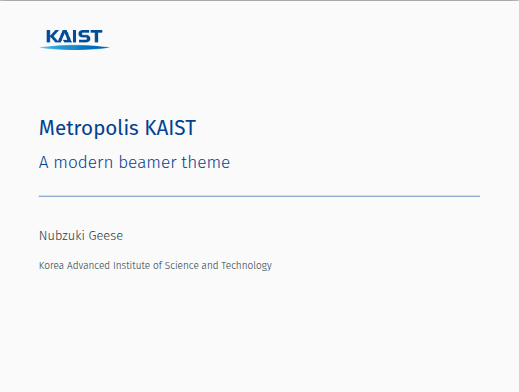

# KAIST-Metropolis-Beamer-template

An **unofficial KAIST Beamer template** based on the 
[Metropolis theme](https://github.com/matze/mtheme).  
This theme adapts the modern and minimal design of Metropolis to the **KAIST color palette** for academic presentations, theses, and seminars.

---

## ✨ Features
- Built on the [Metropolis Beamer Theme](https://github.com/matze/mtheme)
- KAIST official color palette ([dark blue, light blue, gray, etc.](https://www.kaist.ac.kr/kr/html/kaist/010401.html))
- Progress bar on frametitle / section pages
- Customizable block environments (transparent or filled styles)
- Compatible with Overleaf and local TeXLive

---

## 📂 Usage

1. Clone this repository or copy the following files into your project:
   - `beamercolorthemeKAIST.sty`
   - `KAIST_logo.png` (optional, for title slide)

2. In your main `.tex` file, load the theme:
   ```latex
   \documentclass{beamer}
   \usetheme[progressbar=frametitle]{metropolis}
   \usecolortheme{KAIST}

   \title{My KAIST Presentation}
   \author{Your Name}
   \institute{KAIST}
   \date{\today}

   \begin{document}
   \maketitle
   \end{document}
   
3. Compile with xelatex or lualatex for best results (font handling).

## 📷 Preview

Example slides using this theme are available in [demo.pdf](demo.pdf).



## 📜 License

The original Metropolis theme is licensed under [CC-BY-SA 4.0](https://creativecommons.org/licenses/by-sa/4.0/).
Accordingly, this modified KAIST version is also distributed under CC BY-SA 4.0.

## 📬 Contact
If you have suggestions or improvements, feel free to open an issue or pull request.
